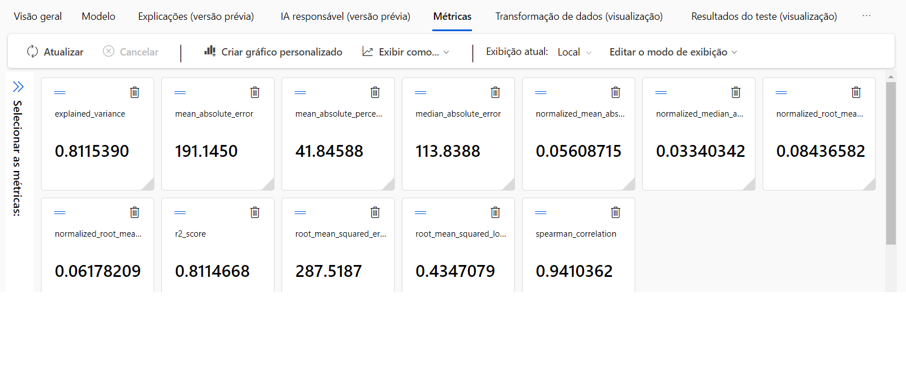

# Desafios-azure
## Vou colocar o passo a passo dos desafios aqui

- Primeiro passo criei uma conta Azure, depois acessei  o portal do Azure e cliquei em "criar um recurso" para criar;
Segunda pesquisei por Machine Learning, e acessei o azure Machine Learning para criar um workspace do Machine Learning;
Grupo de recurso: Desafio
Detalhes do workspace:
Nome: laboratorioia900;
região: East US;
e resto não alterei nada e fui para examinar + criar;
criado.
Depois de criado acessei o resurso para poder acessar a parte de "Trabalhar com seus modelos no Estúdio do Azure Machine Learning", cliquei para acessar o estudio e ele me direcionou para outra pagina;
cliquei em ML Automatizado
Criando uma Novo trabalho de ML automatizado seguindo o passo a passo do desafio:
Nome do trabalho : mslearn-bike-automl
Novo nome do experimento : mslearn-bike-rental
Descrição : Aprendizado de máquina automatizado para previsão de aluguel de bicicletas
Marcadores : nenhum
* Selecione o tipo de tarefa : Regressão
Selecionar conjunto de dados : crie um novo conjunto de dados com as seguintes configurações:
Tipo de dados :
Nome : aluguel de bicicletas
Descrição : dados históricos de aluguel de bicicletas
Tipo : Tabular
* Fonte de dados :
Selecione Dos arquivos da web
URL da Web :https://aka.ms/bike-rentals
* Configurações :
Formato de arquivo : Delimitado
Delimitador : Vírgula
Codificação : UTF-8
Cabeçalhos de coluna : apenas o primeiro arquivo possui cabeçalhos
*Cliquei em criar e depois de criado vamos fazer a 
Configurações de tarefa :
Tipo de tarefa : Regressão
Conjunto de dados : aluguel de bicicletas
Coluna de destino : Aluguéis (inteiro)
Configurações adicionais :
Métrica primária : raiz do erro quadrático médio normalizado
Explique o melhor modelo : Não selecionado
Usar todos os modelos suportados : Desmarcado . Você restringirá o trabalho para tentar apenas alguns algoritmos específicos.
Modelos permitidos : Selecione apenas RandomForest e LightGBM — normalmente você gostaria de tentar o máximo possível, mas cada modelo adicionado aumenta o tempo necessário para executar o trabalho.
Limites : expanda esta seção
Máximo de testes : 3
Máximo de testes simultâneos : 3
Máximo de nós : 3
Limite de pontuação da métrica : 0,085
Tempo limite : 15
Tempo limite de iteração : 15
Habilitar rescisão antecipada : selecionado
Validação e teste :
Tipo de validação : divisão de validação de trem
Porcentagem de dados de validação : 10
Conjunto de dados de teste : Nenhum
Selecione o tipo de computação : sem servidor
Tipo de máquina virtual : CPU
Camada de máquina virtual : Dedicada
Tamanho da máquina virtual : Standard_DS3_V2*
Número de instâncias : 1
Enviei o trabalho de treinamento, aguardei a validação do trabalho 
Em seguida criei um modelo de registro
para poder ver as metricas

Depois de visualizar as metricas eu criei uma ponto de extremidade para poder testar o codigo

 {
   "Inputs": { 
     "data": [
       {
         "day": 1,
         "mnth": 1,   
         "year": 2022,
         "season": 2,
         "holiday": 0,
         "weekday": 1,
         "workingday": 1,
         "weathersit": 2, 
         "temp": 0.3, 
         "atemp": 0.3,
         "hum": 0.3,
         "windspeed": 0.3 
       }
     ]    
   },   
   "GlobalParameters": 1.0
 }
 

E depois exclui tudo
